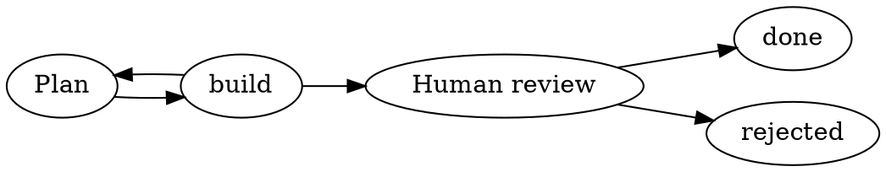

# C02 — The DOT format `spore` reads

Design record of the grill held on 2026-10-07 for the map ticket **C02 — The DOT format spore reads** (Web-tree/runspore#7, map #5). It settles how a workflow is written, built, shipped and pinned: a **workflow folder** holding `workflow.dot` (topology, kinds, routing) and `settings.json` (the structured, non-topology slice of the package), plus the instruction and asset files the settings name; a build that turns the folder into one immutable **workflow artifact**, a WebAssembly component exporting the `runspore:artifact` world (`manifest()`, `blob(digest)`); an optional **composed artifact** that adds the certified kernel component to the same file and exports `runspore:machine` unchanged; and a run record that keeps the package digest as its identity and records the artifact digest beside it. The canonical JSON package stays the kernel's internal form and is no longer a public input. The `workflow` node type (workflows built from workflows) is left to a separate map. The visual is at [c02-dot-format-visual.html](c02-dot-format-visual.html): a levels × personas matrix of every programmable surface, with the two DX gaps this map does not fill marked as such.

Scope rules that held throughout: Runspore stays generic (nothing here names a particular host, editor or integration); the map's locked decisions were not relitigated (DOT, not JSON, is the authoring format; the kernel's canonical JSON package is the semantic source, ADR A02; the DOT frontend lives in `spore`); this is a spec, not code.

## Terms

- **Package** — The canonical JSON document of one workflow (`runspore.workflow/0.1`) that the kernel reads, identified by its digest; a run pins it and always executes the stored copy. *Avoid:* compiled workflow, IR file, "the JSON".
- **DOT dialect** — The subset of DOT grammar plus the attribute vocabulary that `spore` reads; one named, versioned frontend to the package (ADR A02). *Avoid:* DOT format, Graphviz file, the DOT standard.
- **Kernel component** — The one WebAssembly component that holds the kernel; `spore` embeds it and every host runs the same bytes. *Avoid:* workflow.wasm, "the WASM".
- **Workflow folder** — The directory holding one workflow: `workflow.dot`, `settings.json`, and the instruction and asset files the settings reference by relative path; the build's input and `spore`'s entry point. *Avoid:* project, bundle, source tree, package.
- **Settings file** — `settings.json` in the workflow folder: the structured, non-topology slice of the package (action bindings, mappings, limits) plus relative paths to instruction and asset files. *Avoid:* bindings file, config, node file.
- **Workflow artifact** — The immutable WebAssembly file a build produces from a workflow folder; a run pins it by digest. Runspore's kernel and host are the runtime that executes it. *Avoid:* bundle, package (the kernel document inside it), binary.
- **Composed artifact** — The workflow artifact and the kernel component composed into one WebAssembly component, for hosts that can load only a fixed component. *Avoid:* kernel+graph wasm, standalone binary, fat artifact, bundle.
- **Expansion** — Proposed, out of this map: the build copies a referenced workflow's nodes into the parent package, so both run as one run. *Avoid:* flattening, sub-workflow (ambiguous).
- **Child run** — Proposed, out of this map: a run that a node of another run starts from a pinned package, with its own ID, limits, state and result (docs/06 "Child workflow"). *Avoid:* sub-run, nested run, sub-workflow (ambiguous).

## Why

The map's destination is a profile that runs workflows from inside a coding session and survives the session being killed mid-step. The format question is what an author writes, what `spore` reads, and what a resumed run keeps. In Max's words, over the session:

- "I guess, we more need sub-workflows. so node could be another workflow. so, for example, if we have a high-level workflow like: plan->implement->review->deliver, each step can be a complex workflow under the hood."
- ".dot file should be compiled to wasm"
- "Before starting a run, compile DOT, referenced workflows, settings, and required assets into one immutable WebAssembly artifact. Runspore supplies the runtime. Each run pins the saved artifact by digest and always resumes using that artifact plus its separately stored state. Updates affect new runs only. Building happens automatically from source or explicitly for distribution."
- "in this map, we implement the nodes, but left the "workflow" type of node for separate map."
- "Accept DOT source directly and prebuilt WebAssembly workflow artifacts. Starting from DOT automatically builds and saves the immutable artifact. JSON workflow files are not public inputs; internal JSON representation is a separate implementation detail."
- "Use one folder per workflow, with fixed main filenames: workflow.dot and settings.json. Optional instructions and assets live inside that folder and are explicitly referenced by relative path in the settings. Runspore accepts either the workflow folder or its main DOT file as the entry point. The build collects the declared references and required dependencies into the immutable WebAssembly artifact."
- On the visual: "I want to see the programmable interface for each level of the runspore for each user persona profile. Especially, for users who want to develop the workflows and create custom nodes. Also, for developers who want to use workflows in their code. I want to understand if the thing that we're building has a good DX for its users."
- On `spore build`: "`spore build deploy/` should be runnable without `-o`. then file should be the same as a folder name."

A second-agent brief from Max (2026-10-07) set the direction the questions were restructured around: a generic runtime; workflows built from workflows; local DOT loading prepares a package; an explicit build into one immutable versioned artifact; WIT declares contracts, not behaviour; an optional kernel-plus-graph component.

## Locked decisions

Each of these passed all three gates: hard to reverse, surprising without context, a real trade-off.

### L1. Where settings and prose live (Q1 → C)

**Decision.** The DOT carries topology and node kinds. One settings file per workflow carries action bindings, mappings and limits. A prose file exists only where a step has instructions for an outside actor (an external step). The "workflow references" clause of the chosen option dropped out of this map when Q5 moved the `workflow` node type to a separate map.

**Rejected.**
- *A — one file per step, settings in frontmatter, prose as the body.* Lost because it makes Markdown frontmatter the home of every step's settings, commands included, and forces a file on steps that have no instructions.
- *B — DOT is topology only; every node has a file, kind included.* Lost because the `.dot` becomes a bare edge list that says nothing about what a node is.
- *D — everything in DOT attributes as string encodings (`argv="cargo test"`).* Lost on the first quoted argument; the old map's L03 (no structured data in attribute strings) carries over.

### L2. The compile boundary (Q2, answered in Max's words: ".dot file should be compiled to wasm")

**Decision.** The answer was kept verbatim and unpacked by three later questions: what "compiled to WASM" means (Q4), whether `spore` takes `.dot` directly (Q7), and what the artifact pins and how it ships (Q8). The three options drafted for Q2 (A: `.dot` accepted everywhere with in-memory compile and prose inlined into the package; B: explicit `spore compile ... -o workflow.json`; C: package references files by path, read at dispatch) were superseded by those answers. One cost named under Q2 is worth keeping: anything inlined into the package crosses into the kernel on every `transition`. The final design avoids it: instructions and assets are artifact entries, not package fields, so the package stays small.

### L3. What "compiled to WASM" means (Q4, answered in Max's words)

**Decision.** Before a run starts, the DOT, its settings and its required assets are built into one immutable WebAssembly artifact. Runspore supplies the runtime: the artifact is data that the shared kernel runs, not generated code and not a kernel copy per workflow. Each run pins the saved artifact and resumes from it plus its separately stored state; updates affect new runs only; building happens automatically from source or explicitly for distribution.

**Rejected.**
- *A — a distributable holding kernel and workflow.* Not rejected outright: it became the composed artifact (Q9 → B), a second form beside the plain artifact, never the only one.
- *B — each workflow compiled to its own executable program.* Lost because it turns workflows into code: every workflow becomes a program to build, version and certify, and the package digest, `get_package`, the golden traces and ADR M08 would all change. That is a map-level relitigation of A02.
- *C — shorthand for "DOT compiles to the package", no new `.wasm`.* Lost because Max wants one immutable file to pin and distribute, which the package alone does not give.

Thread: Max asked whether the build should emit a `.wit` file. No: `contracts/wit/machine/machine.wit` already declares the one function every host calls (`transition(request) -> result<decision, failure>`), and a workflow enters it as `request.graph: list<u8>`, the package bytes. WIT declares types and functions, not behaviour. A `.wit` per workflow would only make sense later for steps implemented as typed components; that is fog, not this ticket.

### L4. Workflows built from workflows: not in this map (Q5, answered in Max's words)

**Decision.** This map implements the step nodes. The `workflow` node type (a node that runs another workflow) and its run model go to a separate map. Q6 (same-run expansion vs child run) is deferred with it. The required `dialect` attribute (R5) keeps that later addition non-breaking.

**Rejected.**
- *A — spell the reference and settle its run model here.* Lost because the run model is kernel and store work (semantics 0.2), not a format detail.
- *B — reserve the node form now, run model later.* Lost to Max's call to keep it entirely out; the dialect version covers the compatibility concern B was for.
- *C — not in this map, no reserved spelling.* This is the effective outcome, with the dialect version as the safeguard.

### L5. Inside the artifact: a component with byte exports (Q8 → B)

**Decision.** The workflow artifact is a WebAssembly **component** whose exports return bytes: `manifest()` and `blob(digest)` (interface fixed in L8). Loading an artifact means instantiating it.

**Rejected.**
- *A — a core module with no code: custom sections (`runspore:manifest`, `runspore:package/<digest>`, `runspore:asset/<path>`) read with a section parser.* Lost although it was the recommendation: it is data all the way down, deterministic bytes from `wasm-encoder`, readable without Wasmtime, and executes nothing. It lost because custom sections are an opaque convention that no WASM tool validates and only `spore` reads; WASM would be the container, not an interface.
- *C — the kernel embedded too, as the only artifact shape.* Lost because it contradicts "Runspore supplies the runtime", ties every workflow to one kernel build, and the host still needs the package bytes out of it (so C contains A or B anyway). It survives as the optional composed artifact.

Explore table recorded for Q8 (abridged):
- *A pros:* section parser of a few dozen lines, no instantiation; reproducible bytes; no code in the file; additive sections. *A cons:* opaque convention; `wasm-tools print` shows bytes; zero-function module reads oddly; naming/ordering/size rules needed for the digest to mean anything.
- *B pros:* self-describing through WIT (`wasm-tools component wit` lists it); one loader path for kernel and artifacts; jco can transpile it for a JS host; room for a `validate` export later. *B cons:* reading a definition requires Wasmtime or jco; reproducible bytes depend on component toolchain versions; executable code inside something meant as data; larger and slower to load than a section read.
- *C pros:* one file for hosts that forbid dynamic loading; exact certified kernel+graph pair. *C cons:* a kernel fix means rebuilding every artifact; host still needs package bytes; identity must carry the kernel digest; per-workflow certification.

Thread: "is it one way or two way door decision?" — Two-way with a tail. The artifact format carries a version and every run pins its artifact by digest, so a later layout change costs a reader for the old layout, not a migration. The one-way part is L3: once artifacts with no kernel are in the wild, a kernel-embedded form can only be added beside it.

### L6. The settings file: JSON in the package's shape minus topology (Q10 → A)

**Decision.** `settings.json` is JSON in the package's own shape minus topology: `format`, `limits`, `actions`, and `nodes.<id>` carrying only the non-routing fields (`action`, `input`, `output`, `error`, `signal`, as the package defines them). One schema, validated by the same types; the build merges it with the DOT. It is public JSON because it is a slice; the complete package JSON stays internal (R2).

**Rejected.**
- *B — YAML of the same shape.* Lost because it buys comments at the cost of a second parser and canonical-form rules (no aliases, tags, duplicate keys).
- *C — a friendlier authoring schema that compiles to the package.* Lost because it is a second language to specify and keep in step with the package.

See R4 for how file references fit into this shape without breaking it.

### L7. Edge outcomes and the start node (Q12 → A)

**Decision.** Edges route by outcome: `on="<outcome>"` per edge; absent means `ok`; one outcome per edge (repeat the edge for another outcome); `on="failed"` is the failure route. `start="<node id>"` is a graph attribute. `label` is render-only and never carries meaning. Node kinds are the node attribute `kind` with the package's values (`activity`, `await-signal`, `complete`, `fail`); absent means `activity`.

**Rejected.**
- *B — `label` carries the outcome; `start` is the first node statement.* Lost because a cosmetic label change becomes a routing change and the start node depends on statement order (in the reference loop the start node is re-entered, so "the node with no incoming edge" does not identify it).
- *C — as A, but `on` accepts a comma list.* Lost because it puts a list inside an attribute string, the encoding the old map ruled out, for a saving of one line.

### L8. The artifact component's interface (Q15 → A)

**Decision.** An import-free WIT world `runspore:artifact@0.1.0` with two exports: `manifest() -> list<u8>` returning a canonical JSON manifest, and `blob(digest) -> option<list<u8>>` returning any content-addressed entry (the package, a source file, an instructions file, an asset). Spelling in §Spec below.

**Rejected.**
- *B — one export `bundle() -> list<u8>` with everything inlined in one JSON document.* Lost because it makes the component a wrapper around one blob, which is Q8's option A in disguise.
- *C — typed exports per kind (`packages()`, `assets()`, `source-map()`).* Lost because the WIT grows with every new kind and still has to carry bytes.

An import-free artifact also composes with the kernel (R3) without wiring: neither component imports anything, so the composition only instantiates both and re-exports their interfaces (L9).

### L9. What the composed artifact exports (Q16 → A)

**Decision.** The composed artifact exports both worlds unchanged: the kernel's `runspore:machine` and the artifact's `runspore:artifact`. A host loads one file, reads the package with `blob(main)`, and drives `transition` exactly as with the separate kernel. It is a fixed WAC composition, run by `spore build`, that instantiates the certified kernel component and the workflow artifact side by side and re-exports both interfaces. A plain `wasm-tools compose` cannot produce it: wasm-compose only plugs the root component's imports, needs at least one of them satisfied, and exports only the root's exports, and neither component has an import. The kernel inside is the certified build byte for byte, so nothing new is certified per workflow.

**Rejected.**
- *B — only `machine`, with the kernel reading the graph from the embedded artifact.* Lost because it needs a `machine` 0.2 (the kernel importing the artifact interface) and puts a per-workflow kernel variant behind a new WIT whose conformance is proven only for the standalone kernel.
- *C — a new, smaller world hiding both (`transition(snapshot, event)` with the graph implicit).* Lost for the same reason, plus a third contract to keep.

## Routine choices

- **R1. Parser posture (Q3 → A).** Strict. Accept `digraph`, node and edge statements, attribute lists, comments, quoted strings, chained edges (`implement -> test -> approve`), graph attributes; `node [...]` / `edge [...]` defaults only with render attributes. Reject with a line number: subgraphs, ports, HTML labels, `strict`, undirected graphs. Unknown attribute names are errors. A documented allowlist of Graphviz render attributes is ignored so the file still renders; the `dot` binary is never required. Rejected: B (unknown attributes warn) because a typo in `on=` would route nothing at run time; C (parse full DOT, ignore the rest) for the same reason; D (no chains, defaults or graph attributes) as needlessly narrow.
- **R2. Public inputs (Q7, Max's words).** `spore` accepts DOT source (a workflow folder or its `workflow.dot`) and prebuilt workflow artifacts. Starting from DOT builds and stores the artifact automatically. JSON workflow files are not public inputs; the package is an internal representation. Consequence: spec/cli.md 0.1 takes `<workflow.json>` on `validate`, `start` and `run`, so this is a CLI 0.2 change; `examples/*.json` and the golden traces become internal fixtures; a debugging `spore inspect <artifact>` that prints the internal form stays possible, marked not a stable interface (like text output today).
- **R3. The composed artifact is a second distribution form in this map (Q9 → B).** Max first accepted A (later and optional) and 46 seconds later sent B; B stands. Rejected: A, and C (drop it from the architecture). Produced by `spore build` with a flag (name provisional); L9 fixes what it exports.
- **R4. The workflow folder and how files find each other (Q11, Max's words).** One folder per workflow with fixed names `workflow.dot` and `settings.json`. Optional instructions and assets live in the folder and are referenced by relative path from the settings; only declared files enter the artifact; a stray file is ignored. Entry point is the folder or its `workflow.dot`. The workflow `name` is the DOT graph id, not the folder name (folder names are not portable). Max's example: `deploy/ ├ workflow.dot ├ settings.json ├ instructions/review.md └ assets/calculate.wasm`. Rejected (as drafted before the text answer): B (a graph attribute naming the settings file) because the DOT would carry a file path, its only non-topology fact; C (`w/<node>.md` by convention) because a stray `.md` would silently join a workflow.
  *File references and the package shape (my resolution of L6 against this answer; Max did not rule on it, see Open threads):* package nodes reject unknown fields, so a file reference cannot sit on a node and keep the settings file a pure slice. The settings schema is therefore the package schema plus two optional reference fields that the build resolves into manifest entries and strips before producing the package: `instructions` (a relative path) on a node, and `assets` (a list of relative paths) on an action. After stripping, the result validates with the package's own types. The manifest entry records which node or action declared the file. A reference must stay inside the workflow folder: the build resolves `..` and every symlink and checks the final path, and an absolute path, a traversal or a symlink whose target lies outside the folder is a build error (the path-or-symlink-escape control in `docs/11-security.md`). A workflow folder from another author therefore cannot pull local files into a distributable artifact.
- **R5. Dialect version (Q13 → A).** Required graph attribute `dialect="runspore/0.1"`, checked before any other rule; a missing or unknown value is the first error reported. `settings.json` keeps the package's `format` field; the two must agree; the manifest records both. Rejected: B (optional, absent means current) hides a mismatch until an attribute happens to be unknown; C (none) ties files to a binary version nobody records.
- **R6. What the run record pins (Q14 → B).** The run keeps `package_digest` as its identity (kernel identity and `get_package` untouched) and adds `artifact_digest`, the digest of the file the run was started from (workflow artifact or composed artifact), as provenance. The store adds one content-addressed artifact table beside packages: an additive store 0.2 change, nothing frozen is redefined. Rejected: A (the run pins the artifact digest and the host extracts the package every turn) because it reopens two frozen contracts for the same guarantee, and because artifact bytes depend on component tooling, which must not become the kernel's identity.
- **R7. Build errors.** A settings entry for a node the DOT lacks, or a DOT `activity` node with no settings entry, is a build error naming both files. A file reference that is absolute or resolves outside the folder (R4) is a build error naming the reference. A `complete` or `fail` node with an outgoing edge, a declared outcome of the bound action with no edge, or two edges from one node with the same `on`, are build errors naming the line.
- **R8. `spore build` output (visual feedback).** `spore build deploy/` runs without `-o` and writes `deploy.wasm` next to the folder (a sibling, so the artifact never lands inside the source folder); `-o <file>` overrides. The composed form defaults to `deploy-composed.wasm` with its flag; both the flag and that name are provisional until the CLI spec.
- **R9. Manifest contents (Q15 thread).** `format: "runspore.artifact/0.1"`, `dialect`, `name`, `main` (the package digest the run pins), `entries[]` of `{path, digest, kind, owner}` with kinds `source`, `instructions`, `asset`; paths are folder-relative. `workflow.dot` and `settings.json` ride along as `source` entries so `spore inspect` shows what was built and a rebuild is checkable.

## Spec

Normative wording to carry into `spec/dot.md`, `spec/artifact.md` and the CLI 0.2 revision. Examples are illustrative, not the repo's reference loop.

### `workflow.dot`



Grammar: R1. Attributes with meaning: graph `dialect` (required), `start` (required); node `kind` (optional, default `activity`); edge `on` (optional, default `ok`). Everything else must be on the documented render allowlist (initially `label`, `shape`, `style`, `color`, `fillcolor`, `fontcolor`, `fontname`, `fontsize`, `penwidth`, `arrowhead`, `arrowtail`, `tooltip`, `rankdir`, `splines`, `nodesep`, `ranksep`, `bgcolor`) or it is an error. Node ids obey the kernel rule `[A-Za-z0-9_-]{1,64}`; outcomes obey `[a-z0-9][a-z0-9-]{0,63}`; at most 256 nodes. The graph id is the workflow `name`.

### `settings.json`

```json
{
  "format": "runspore.workflow/0.1",
  "limits": { "maxVisitsPerNode": 16, "maxActivations": 256 },
  "actions": {
    "make-plan": { "kind": "command", "effect": "read-only", "argv": ["./plan.sh"],
                   "outcomes": ["ok"], "exitOutcomes": { "0": "ok" } },
    "build":     { "kind": "command", "effect": "idempotent", "argv": ["cargo", "build"],
                   "outcomes": ["ok"], "exitOutcomes": { "0": "ok" }, "assets": ["assets/calculate.wasm"] }
  },
  "nodes": {
    "plan":   { "action": "make-plan" },
    "build":  { "action": "build" },
    "review": { "signal": "review", "instructions": "instructions/review.md" },
    "rejected": { "error": { "code": "review.rejected", "message": "the reviewer rejected the change" } }
  }
}
```

Shape: L6 and R4. `nodes.<id>` carries no routing (`routes`, `start`, kinds come from the DOT). After the build strips `instructions` and `assets`, the merged document must validate as a `runspore.workflow/0.1` package with the existing types. Every action declares `effect`; `failed` is never declared in `outcomes` (the kernel reserves it), yet a DOT edge `on="failed"` still routes a failure.

### The `runspore:artifact` world

```wit
package runspore:artifact@0.1.0;

interface reader {
  /// Canonical JSON manifest, format "runspore.artifact/0.1".
  manifest: func() -> list<u8>;
  /// Bytes of the entry with this content digest (the package via `main`,
  /// or any manifest entry); none when the artifact holds no such entry.
  blob: func(digest: string) -> option<list<u8>>;
}

world artifact {
  export reader;
}
```

The world imports nothing. The composed artifact exports this world and `runspore:machine@0.1.0` side by side (L9).

### The manifest

```json
{
  "format": "runspore.artifact/0.1",
  "dialect": "runspore/0.1",
  "name": "deploy",
  "main": "sha256:<digest of the package>",
  "entries": [
    { "path": "workflow.dot",            "digest": "sha256:…", "kind": "source" },
    { "path": "settings.json",           "digest": "sha256:…", "kind": "source" },
    { "path": "instructions/review.md",  "digest": "sha256:…", "kind": "instructions", "owner": { "node": "review" } },
    { "path": "assets/calculate.wasm",   "digest": "sha256:…", "kind": "asset",        "owner": { "action": "build" } }
  ]
}
```

Digests are examples. Canonical JSON follows the package's existing canonicalisation so the manifest bytes, and therefore the artifact's content, are reproducible from the same inputs and toolchain.

### Host load sequence

1. Instantiate the artifact (or composed artifact) and call `manifest()`; check `format` and `dialect`.
2. `blob(main)` → package bytes; verify the digest; store the package content-addressed (existing `put_package`) and the artifact bytes in the artifact table (R6).
3. Create the run with `package_digest = main` and `artifact_digest = <digest of the file>`.
4. Drive the kernel as today: `transition(request{identity, graph: <package bytes>, …})`. Every later turn fetches the package by `package_digest` (`get_package`); the source is never reread.

### CLI 0.2 surface

| Command | Input | Effect |
|---|---|---|
| `spore validate <folder \| workflow.dot \| artifact.wasm>` | source or artifact | parse, merge, build in memory; errors with file and line |
| `spore start` / `spore run` (same inputs) | source or artifact | from source: build, store the artifact, start; from an artifact: store and start |
| `spore build <folder> [-o file] [<composed flag>]` | folder | writes `<folder>.wasm` beside the folder, or `<folder>-composed.wasm` with the flag (provisional names) |
| `spore inspect <artifact>` | artifact | prints manifest and package for debugging; not a stable interface |
| `spore signal`, `spore status` | unchanged | |

JSON workflow files are not accepted as inputs.

## Verified facts

Established by exploring the repo, not by asking:

- The package (`runspore.workflow/0.1`) has `name`, `start`, `limits{maxVisitsPerNode (default 16), maxActivations (256)}`, `actions` (free JSON values; the kernel reads only `outcomes`, `effect`, `retry`) and `nodes` of kinds `activity`, `await-signal`, `complete`, `fail`; node types are `deny_unknown_fields` (`crates/runspore-types/src/model.rs`). Node ids `[A-Za-z0-9_-]{1,64}`, max 256 nodes (`graph.rs:82`), outcomes `[a-z0-9][a-z0-9-]{0,63}`; mappings use `$get` / `$literal`; exceeding `maxVisitsPerNode` is a terminal unroutable `failed` (the loop-bound answer belongs to C13, #19).
- The store keeps packages content-addressed by digest; a run always executes the stored package (`get_package`); starting with the same key but changed source fails with `request.digest-mismatch` (spec/store.md, spec/host.md §2).
- The kernel's WIT (`contracts/wit/machine/machine.wit`): `package runspore:machine@0.1.0`, interface `reducer`, `request{identity, graph: list<u8>, snapshot, input-event, frozen-limits}`, exports `describe` and `transition`. WIT declares contracts, not behaviour.
- `spore validate w.dot` today fails with `canonical.syntax`, exit 2 (checked by a subagent on the current build).
- State budget 256 KiB per run (`reducer.rs:35-44`); the kernel component's build is reproducible and tested as such (`component_build_is_reproducible`).
- `cargo test -p runspore-types`: 19 pass; Wasmtime reducer/component tests: 14 pass (2026-10-07).
- spec/host.md §3 already defines a `native` action kind (`{"kind": "native", "function": "<name>"}`, line 190) and custom action kinds through the `ActivityRunner` trait and `ActivityRegistry` (lines 40, 147). So a Rust embedder can add action kinds today; the `spore` binary itself runs `command` only.
- `command` action fields: `argv`, `cwd`, `env`, `timeoutMs`, `output`, `exitOutcomes`; the host sets `RUNSPORE_RUN_ID`, `RUNSPORE_NODE_ID`, `RUNSPORE_INVOCATION_ID`, `RUNSPORE_ATTEMPT`, `RUNSPORE_EFFECT_KEY` (effect key stable across attempts; `spore run` on an existing key resumes).
- Semantics 0.1 out of scope (spec/README.md): timers, fork/join, child workflows, compiler/DOT/YAML frontends, JSON Schema validation, blobs, PostgreSQL, JS host. docs/06 defines a child workflow as an independent run with a deterministic child id, and says DOT export from a package is always available.
- ADRs in force: A01 one Rust semantics implementation; A02 bounded graph IR as the semantic source with DOT/YAML frontends; A06 immutable package and run versions; M08 the certified artifact is the kernel component; M12 no cancellation in 0.1.
- Carry-over from the old skills-repo map (C01): L03 (no structured data in DOT attribute strings) holds, amended; the `dot` binary is never required; W05/W07/W10 land here.

## Risks

- **Reproducible artifact bytes depend on component tooling.** Component encoding comes from `wasm-tools` / `cargo component`, so the same source may give different artifact digests across toolchain versions. Mitigated by R6: the run's identity is the package digest, which is canonical JSON and toolchain-independent; the artifact digest is provenance only.
- **Reading a definition requires instantiation.** `spore status`, `spore list` or any tool that only wants to read a workflow needs Wasmtime or jco. Accepted with Q8 → B; `spore inspect` and the `source` entries keep inspection possible.
- **Executable code in a data artifact.** Every artifact must be instantiated as untrusted code to return bytes; the host sandboxes it like the kernel. The import-free world (L8) limits the surface.
- **CLI 0.2 is a breaking change.** JSON inputs disappear from the public surface; examples and golden traces move to internal fixtures; downstream scripts that pass `<workflow.json>` break.
- **Two digests on a run record.** Operators must learn which one is identity; `spore status` should print both with labels.
- **Allowlist upkeep.** A render attribute missing from the allowlist is an error for the author until the list is extended.
- **Instructions and assets are in the artifact but nothing reads them at dispatch.** How an action gets a materialised path or the bytes of its declared files is not specified here (fog on the map). Until it is, `instructions` and `assets` are carried, pinned and inspectable but not delivered.
- **`spore` runs only `command`.** A module such as `assets/calculate.wasm` rides along with no action kind to consume it. Custom kinds exist for Rust embedders only (`ActivityRunner`).
- **No host library for embedding.** A developer who wants to run workflows from code has the CLI, the two WIT worlds (and must implement store and dispatch), or the composed artifact. Not this map's gap to fill; a candidate ticket.
- **Deferred composition must stay expressible.** When the `workflow` node type arrives, the dialect bumps (`runspore/0.2`) and the manifest gains entries for referenced packages; L8's `blob(digest)` already admits them.

## Deferred

- **Q6 — Same-run expansion or child run.** Deferred with Max's Q5 answer: the run model of a `workflow` node belongs to the separate composition map. The recorded recommendation was B (child run: an independent run of the pinned referenced package, with its own id, limits, state and result, as docs/06 already defines), because expansion shares the 256-node and 256 KiB budgets with the parent, has no result value without a new kernel node, and a visit-limit failure inside it ends the whole run; B costs semantics 0.2 and, with no cancellation in 0.1, a failed parent cannot stop its child. Reopens if that map is folded back into this one.

## Open threads

- **File references versus the package's `deny_unknown_fields` nodes.** R4's strip-before-validate rule is my reconciliation of L6 (settings = pure slice) with Max's Q11 answer (references live in the settings). Max did not rule on it; the alternative is a separate top-level `files` section in `settings.json`.
- **A `.wit` per workflow.** Raised by Max on Q4; answered "no consumer today". It returns if steps become typed components with input/output derived from node schemas (JSON Schema validation is itself out of 0.1).
- **DX gaps from the visual feedback.** Custom node kinds in `spore` beyond `command`; a host library for embedding; asset and instruction delivery at dispatch. Each is a candidate map ticket, not a reopen of a decision here.
- **Exporter.** Q12's reasoning assumed a later exporter that emits `label` from `on` for rendering; not specified.
- **Composed-build flag and output names.** `<composed flag>` and `deploy-composed.wasm` are placeholders for the CLI spec.
- **`spore inspect` output.** Agreed to exist as a debugging aid; its format is deliberately unstable.
- **Documentation drift.** Edits made during this session to `CONTEXT.md`, `docs/01`, `docs/04`, `docs/05`, `docs/06`, `docs/17`, `docs/sources.md` and `work/tasks.md` (uncommitted on `docs/agent-skills-and-glossary`) predate L5–L9 and describe a "bundle"; they need reconciling to the artifact-as-component design before they land.
