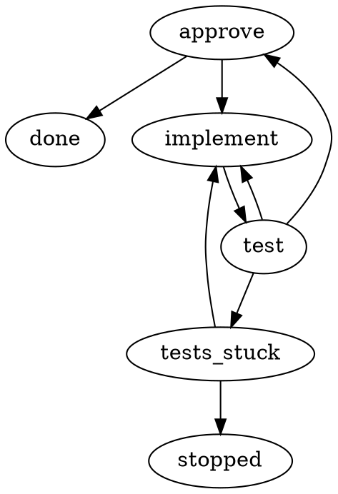

# C13 — Bounded loops that route somewhere

Design record of the grill held on 2026-10-10 for the map ticket **C13 — Bounded loops that route somewhere** (Web-tree/runspore#19, map #5). It settles how a workflow says "after N trips round this loop, go to that step". A step that judges a loop (in the reference workflow, `test`) carries a **loop limit** per outcome in `settings.json`: `"loopLimits": {"red": 3}` lets `red` send the run back at most 3 times in a row. The next `red` takes the step's `exhausted` arrow instead, which the workflow must draw. Any other result starts the count again. Kernel semantics 0.2 carries the rule; the package format and the DOT dialect move to 0.2 with it. On the profile side, every visit of one Claude step in a run continues one Claude conversation, so a trip back to `implement` remembers what it tried before.

Two rules held throughout. Runspore stays generic: loop limits and `exhausted` are plain kernel routing and say nothing about Claude. And Max asked, early in the grill, to be asked only what brings value: "can we just think about the questions we're asking as about something which really brings the value, not something that really is a standard practice in the workflow engineering". Q1 and Q2 were therefore settled by standard practice and recorded on the page as such, without a vote; Q3 was Max's choice.

## Terms

- **Loop-back** — The run going back to an earlier step along an arrow, e.g. `test` returns `red` and the run goes back to `implement`. Each loop-back is a new visit of that step: a new activation, invocation and effect key (kernel §1, K4). *Avoid:* retry.
- **Retry** — The same visit of a step run again after its try was lost or failed retryably, on the same invocation and effect key, bounded by the action's `retry.maxAttempts` (kernel §7.3). Claude steps get 3 tries and continue their conversation (C07 R13, R14). *Avoid:* loop, loop-back.
- **Loop limit** — How many times in a row a step may send the run along one arrow before the run takes that step's `exhausted` arrow instead. Any other result from the step starts the count again. Written as `loopLimits` on the node in `settings.json`. *Avoid:* retry limit, `maxAttempts` (that is retry), visit limit.
- **Exhausted arrow** — The edge `<node> -> <target> [on="exhausted"]`: where the run goes when one of the node's loop limits is used up. `exhausted` is a reserved outcome, like `failed`: no action may declare it and no signal can take it. *Avoid:* give-up edge, escape edge.
- **Streak** — The kernel's running count for one node: which limited outcome the node took last and how many times in a row. Stored in the run state, reset by any other outcome and by the exhausted arrow. *Avoid:* counter variable, loop variable.
- **Safety net** — The workflow-wide `limits` already in 0.1: `maxVisitsPerNode` (default 16) and `maxActivations` (default 256). Hitting one ends the run as `failed` with `limit.visits-exceeded` or `limit.activations-exceeded`; no edge can route it, and C07 keeps it terminal. *Avoid:* loop limit.

## Why

The map's destination includes "a failed test loops back a bounded number of times, a human approves". In 0.1 the only bound on a loop that crosses nodes is the safety net, and exceeding it ends the run as `failed` with an error no edge can route (kernel §7.4, step 2). `retry.maxAttempts` bounds the tries of one visit and its exhaustion routes through `failed`, but it does not cover the implement → test → implement loop, which is a series of visits, not tries. C01 (L08) recorded the gap: "after N red test runs, go to a person" cannot be drawn in 0.1. The ticket listed three candidates: a routable visit-limit outcome in the kernel, the DOT compiler unrolling the loop N times, or a counter the workflow carries in its own state. C02's resolution comment added that a routable bound is spelled either as a settings field (no dialect change) or as a node or edge attribute in `dialect="runspore/0.2"`, and that nothing structured goes in an attribute string.

Max's words during the grill:

- On scope of the questions (terminal, before any answer): "can we just think about the questions we're asking as about something which really brings the value, not something that really is a standard practice in the workflow engineering". Q1 and Q2 were settled from prior art (Step Functions, Attractor) and kept on the page as answered, open to reopening; Max did not reopen them and pressed Finish.
- Q3: accepted A, every trip continues the same conversation.

## Locked decisions

### L1. A used-up loop takes an arrow the workflow draws (Q1, standard practice)

**Decision.** When a step's loop limit is used up, the run follows that step's `exhausted` arrow. The workflow draws it wherever the target should be: an `await-signal` step that asks a person, a different strategy, or a `fail` node. A node that declares `loopLimits` must route `exhausted`; validation rejects one that does not (W12). The safety net is unchanged and stays terminal.

This follows the failure-handler pattern in Step Functions (`Retry` then `Catch` → `Next`) and in Attractor (an exhausted node routes to its fail edge or `retry_target`, else the pipeline fails). It also matches docs/06's loop rule, "explicit body and exit; immutable max iterations".

The recommendation as first written on the page had a fallback: with no exhausted arrow the run would pause for a person, like a C07 stuck step. The settled answer drops it: the arrow is required. A limit with nowhere to go has no use, and "ask me" is drawn as an `await-signal` step, which the menu and signals already handle. This keeps the kernel from growing a second pause path next to C07's.

Rejected:
- *B — always pause for a person; no arrow in the workflow.* Puts a person in the path even when the answer is predictable ("stop and report"), and hides that route from the diagram.
- *C — end the run as failed, at the workflow's own number instead of the safety net's.* Today's dead end with a different number: nothing in the workflow can catch it, and a failed run cannot be resumed.

### L2. The judging step counts its own results in a row (Q2, standard practice)

**Decision.** The count lives on the step whose result sends the run back round the loop, per outcome: `"loopLimits": {"red": 3}` on `test`. The rule is "this outcome may route at most N times in a row". When the step returns that outcome for the (N+1)th time in a row, the run takes `exhausted` instead of the outcome's own arrow. Any other result from the step starts the count again, and so does taking the exhausted arrow. In the reference loop this gives:

- `test` red three times in a row sends the run back to `implement` three times; the fourth red goes to the exhausted arrow. `implement` therefore runs at most four times per round.
- A reviewer's "rejected, redo it" at approval gets a fresh count, because `test` returned `ok` before approval.
- A person's "keep going" after the loop gave up gets a fresh count, because taking `exhausted` reset it.

Attractor counts in the same place: `max_retries` sits on the node that fails, counts additional executions ("`max_retries=3` means up to 4 total executions"), routes exhaustion to the node's fail edge or `retry_target`, and resets on success ("If outcome.status IN {SUCCESS, PARTIAL_SUCCESS}: reset_retry_counter(node.id)"). Step Functions puts `Retry`/`Catch` on the failing state.

Correction to the page text. The answer text on the page read "test → implement [on="red"] at most 3 times, the 3rd red takes test → ask [on="exhausted"]". The two halves disagree by one. The rule above takes the first half: the number bounds how many times the arrow is taken in a row, so `3` means three loop-backs and the fourth `red` exhausts. This matches the destination's wording ("loops back a bounded number of times") and Attractor's count of additional tries. C11 picks the reference loop's number.

Rejected:
- *A — count visits to the step looped into (`implement` at most 3 times, arrow `implement -> ask [on="exhausted"]`).* The exhausted arrow would leave `implement` on a visit where `implement` never ran. Every entry counts, including a reviewer's "redo it". There is no natural point where the count resets, so "keep going" after it gave up would hit the limit at once.
- *C — a counting step drawn inside the loop (`test -> tries [on=red]; tries -> implement [on=again]; tries -> ask [on=exhausted]`).* It shows the limit as a box on the diagram, but it adds a node kind and an extra node per loop for what one number on the judging step does.
- *D — no core change: a small command step compares the visit number, or `spore` copies the loop N times.* The first spawns a process to compare two integers and hides the number in a shell line. The second breaks references such as `nodes.implement.output` (which copy?) and spends the 256-node cap.

### L3. Every visit of a Claude step continues one conversation (Q3 → A, Max)

**Decision.** In the Claude Code profile, a Claude step keeps one conversation for the whole run. Every visit of the node resumes it, not just every retry of one visit. When failing tests send the run back to `implement`, Claude sees its earlier attempts and every failure it was shown, so it stops repeating fixes it saw fail. A reviewer's "rejected, redo it" also lands in the same conversation. This amends C07 R14, which derived the session id from the effect key and so started each visit fresh. C07's risk "A loop back is a new conversation" is reversed.

This is a profile rule; Runspore is unchanged. The integration already chooses the session id (C07 R14, Max: "that uuid is generated by the claude code integration"). It now derives it from the run and the node instead of the visit (Spec, "Plugin side").

Rejected:
- *B — a fresh conversation each trip, handed a summary of every earlier trip.* It avoids carrying a wrong idea forward, but the run keeps only the latest result per node ("A later visit replaces it", kernel §3). A history of trips would need a kernel change or a store kept by the plugin.
- *C — a fresh conversation with only the latest failure (C07 as written).* Claude does not know what it already tried and can repeat the same fix.

## Routine choices

- **R1. Spelling in `settings.json`, not DOT.** `loopLimits` is a field of the node in `settings.json`, next to `action` and `input`, because C02 put limits in the settings file ("One settings file per workflow carries action bindings, mappings and limits"). The DOT gains no attribute; the exhausted arrow is an ordinary edge with `on="exhausted"`. A renderer may show the number on the arrow from the settings (for example `red ×3`); that is display only.
- **R2. Format and dialect move to 0.2.** A package with `loopLimits` has `format: "runspore.workflow/0.2"`, so a 0.1 kernel rejects it at W01 instead of silently ignoring the field. C02 R5 requires the DOT `dialect` and the settings `format` to agree, so such a workflow says `dialect="runspore/0.2"`. A 0.2 kernel still accepts 0.1 packages; `loopLimits` and the `exhausted` route are 0.2-only.
- **R3. Which node kinds.** `activity` and `await-signal` nodes may carry `loopLimits`. On an `await-signal` node it bounds a person's or a system's repeated answers, e.g. "rejected twice in a row → escalate". `failed` may be limited like any routed outcome; `exhausted` may not.
- **R4. The recorded result is the real one.** When the limit is used up, `nodes[test]` still records `{visit, outcome: "red", output}`, so the step behind the exhausted arrow can map the last failure (`$get ["nodes", "test", "output"]`). The diagnostic `loop.exhausted` marks that the route was the exhausted arrow.
- **R5. The limit must be reachable.** Using up a limit of N needs N + 1 visits of the node, so W12 requires N + 1 ≤ `maxVisitsPerNode`. A limit the safety net would always beat is rejected at validation instead of surprising someone at run time.
- **R6. Range.** A loop limit is an integer in 1..=1000, the same range as `maxVisitsPerNode` (W06).
- **R7. Every resume message carries the current input.** The plugin's wrapper resumes the step's conversation with the step's current input on every try. A retry that follows a lost first try of a new visit therefore still delivers the new failure (Spec, "Plugin side").

## Spec

Normative wording to carry into `spec/kernel.md` 0.2 (with C07's stuck-step change), the package format `runspore.workflow/0.2`, `spec/dot.md` (dialect `runspore/0.2`) and the profile spec. Examples are illustrative; C11 writes the reference loop.

### `settings.json` and DOT



```json
{
  "format": "runspore.workflow/0.2",
  "limits": { "maxVisitsPerNode": 16, "maxActivations": 256 },
  "nodes": {
    "test": { "action": "test", "loopLimits": { "red": 3 } },
    "tests_stuck": { "signal": "tests-stuck" },
    "approve": { "signal": "approval" }
  }
}
```

### Package and validation (kernel 0.2)

An `activity` or `await-signal` node may carry `loopLimits`: an object whose keys are outcomes the node routes and whose values are integers.

- **W01.** `format` is `runspore.workflow/0.1` or `runspore.workflow/0.2`. `loopLimits` and the `exhausted` route are allowed only in 0.2.
- **W07 (amended).** No action outcome is `failed` or `exhausted`.
- **W08 (amended).** An activity node's `outcomes` has a key for every action outcome; the other keys allowed are `failed`, and `exhausted` when the node has `loopLimits`.
- **W09 (amended).** An await-signal node may route `exhausted` only when it has `loopLimits`.
- **W12 (new).** `loopLimits` appears only on `activity` and `await-signal` nodes and is non-empty. Each key is a key of the node's `outcomes` other than `exhausted`. Each value is an integer in 1..=1000 with value + 1 ≤ `maxVisitsPerNode`. A node with `loopLimits` routes `exhausted`.

### State (kernel 0.2)

The state gains `streaks`: an object from node ID to `{"outcome", "count"}`. An entry exists only for a node with `loopLimits` whose last routed outcome is one it limits. A snapshot whose streak names a node without `loopLimits`, an outcome the node does not limit, or a count outside 1..=limit is `invalid-input` / `state.invalid` (kernel §7.1 check 5).

### Routing (kernel 0.2)

Every place in 0.1 that records a node's result and enters `node.outcomes[outcome]` goes through one procedure, **Route(node, outcome, output)**. Those places are a `success` result, `invocation.resolved` with `complete` (including C07's `stuck` invocations), *consume* at an await-signal node, and *fail the invocation* on a node that routes `failed`.

1. Record `nodes[node] = {visit, outcome, output}`.
2. If the node has `loopLimits`:
   - If `outcome` is a key of `loopLimits`: let `n` be `streaks[node].count` when `streaks[node].outcome` equals `outcome`, else 0. If `n + 1 > loopLimits[outcome]`: delete `streaks[node]`, emit diagnostic `loop.exhausted` (details `{"outcome", "limit"}`), *enter* `node.outcomes.exhausted`, and stop. Otherwise set `streaks[node] = {outcome, count: n + 1}`.
   - Otherwise delete `streaks[node]`.
3. *Enter* `node.outcomes[outcome]`.

*Consume* treats a signal whose outcome is `exhausted` as unrouted (`signal.outcome-unrouted`), so no signal can take the exhausted arrow.

`loop.exhausted` carries `nodeId` = the node that used up its limit. The safety net (*enter*, step 2) and mapping failures are unchanged and stay terminal (C07).

New property: **K10** — a limited outcome is never routed more than its limit times in a row. New golden traces: the limit used up takes `exhausted`; a different outcome resets the streak; taking `exhausted` resets the streak; a signal with outcome `exhausted` is unrouted.

### Plugin side: one conversation per Claude step per run

This amends C07 R14 and the background and interactive step procedures.

- **Session id.** The integration computes the Claude session UUID as a name-based UUID over `RUNSPORE_RUN_ID` and `RUNSPORE_NODE_ID` (both given to every command, host.md §3), under a namespace fixed by the plugin. Every visit and every try of one node in one run compute the same UUID.
- **Which message to send.** No session with that UUID exists: this is the first visit; start Claude with `--session-id <uuid>`, the instructions and the input (C07). The session exists and `RUNSPORE_ATTEMPT` is `1`: the run came back to this step; resume with `--resume <uuid>` and say so, with the new input (e.g. the latest failing test output or the reviewer's note). The session exists and `RUNSPORE_ATTEMPT` is above `1`: this is a retry of a lost try; resume and tell Claude to finish the step, again with the current input (R7).
- Interactive steps do the same through the herdr pane the start command opens (C07, "Plugin side: interactive step").

### The reference loop, step by step (limit 3)

1. `implement`/1 starts session U. `test`/1 → `red`: streak `red ×1`, back to `implement`.
2. `implement`/2 resumes U with the failure. `test`/2 → `red` (×2) → `implement`/3 → `test`/3 → `red` (×3) → `implement`/4.
3. `test`/4 → `red`: 3 + 1 > 3, so the run records `nodes.test = {visit: 4, outcome: "red", output}`, emits `loop.exhausted`, clears the streak and enters `tests_stuck`, which waits for a person.
4. The person sends `keep-going`: `implement`/5 resumes U, and `test` counts afresh from 1. Or the person sends `stop`: the run ends at `stopped`.
5. If `test` returns `ok`, the streak clears and the run waits at `approve`. `rejected` resumes U at `implement` with the reviewer's note, and the count starts at 1.
6. Killing the session at any point changes nothing above: the streak is part of the stored run state, and C07's retry and resume rules apply per try.

## Verified facts

- The safety net: `maxVisitsPerNode` in 1..=1000 and `maxActivations` in 1..=10000 (W06); exceeding either in *enter* step 2 is terminal `failed` with `limit.visits-exceeded` / `limit.activations-exceeded` and `nodeId` set, counters not incremented (spec/kernel.md §7.4). C07 keeps limit errors terminal (c07-four-kinds.md, "Kernel semantics 0.2").
- `nodes[id]` holds the latest result of a node, and a later visit replaces it; `visits[id]` counts admitted entries (spec/kernel.md §3).
- `failed` is reserved: no action may declare it (W07), and an activity node may route it in addition to its action's outcomes (W08). *Fail the invocation* enters the `failed` target when the node routes it (§7.4).
- Each visit of a node has a distinct activation and invocation ID; retries keep the invocation ID (K4). The effect key equals the invocation ID (§1).
- Commands receive `RUNSPORE_RUN_ID`, `RUNSPORE_NODE_ID`, `RUNSPORE_INVOCATION_ID`, `RUNSPORE_ATTEMPT` and `RUNSPORE_EFFECT_KEY` (spec/host.md §3). The run ID is `ids::run_from_start_key(tenant, start_key)` (§2).
- C07 R14 derived the session UUID from the effect key, and its risk list says "A loop back is a new conversation" (c07-four-kinds.md).
- C02 R5: the DOT `dialect` and the settings `format` must agree; C02's decision puts limits in `settings.json`; the DOT attributes with meaning are `dialect`, `start`, `kind`, `on` (c02-dot-format.md).
- docs/06's construct table: "Loop | Explicit body and exit; immutable max iterations or overall run budget"; docs/06 separates delivery retries (same invocation) from business rework (a visible loop, a new activation).
- `examples/review-loop.json` bounds its check → rework loop only with `maxVisitsPerNode: 3`, so its fourth visit ends the run as failed.
- Attractor (github.com/strongdm/attractor, `attractor-spec.md`, read 2026-10-10): `max_retries` is "Number of additional attempts beyond the initial execution"; on exhaustion the engine tries the fail edge, the node's `retry_target`, its `fallback_retry_target`, then graph-level targets, else "the pipeline ends with a FAIL outcome"; the counter resets on `SUCCESS` or `PARTIAL_SUCCESS`. Step Functions' `Retry`/`Catch` is cited from general knowledge, not re-read.

## Changes outside C13

- **C07 R14 (docs/design/c07-four-kinds.md).** The session UUID derives from the run ID and node ID, not the effect key, so every visit of a Claude step continues one conversation (L3). The wrapper's choice of message (first visit, new visit, retry) replaces "first try versus rerun". The risk "A loop back is a new conversation" no longer holds. C07's kill-and-resume walkthrough is unaffected: it covers one visit.
- **C02 (docs/design/c02-dot-format.md).** `settings.json` node fields gain `loopLimits`; `exhausted` joins `failed` as a reserved outcome in `on`; workflows that use them say `dialect="runspore/0.2"` and `format: "runspore.workflow/0.2"`. No new DOT attribute.
- **Kernel semantics 0.2.** Adds `loopLimits`, `streaks`, *Route*, `loop.exhausted`, W12 and K10 to C07's stuck-step change.
- **CONTEXT.md.** New terms Loop-back and Loop limit; Agent step gains "Every time a run comes back to the same agent step, the step continues that conversation."
- **C11.** Writes the reference loop with `loopLimits` on `test` and an exhausted arrow, picks the number and the exhausted target, and walks the kill at each step with streaks in the state.

## Risks

- **A conversation that went wrong stays wrong.** With one conversation per step (L3), a wrong idea Claude formed on trip 1 rides along on every later trip. The person's way out is the exhausted step or a rejection note; a per-step option to start fresh is not designed (Open threads).
- **The conversation grows each trip.** Several rounds of "keep going" add up; Claude Code's own compaction then summarises and loses detail. At the reference limit this is small.
- **"Keep going" still meets the safety net.** Each round of the reference loop takes up to four visits of `implement` and `test`. With the default `maxVisitsPerNode` of 16, the fourth round of "keep going" ends the run as terminal `failed` (`limit.visits-exceeded`), which nothing can catch. Authors who expect long rounds raise `maxVisitsPerNode`; the mod should show how close a run is.
- **Session UUID collisions.** The run ID is `ids::run_from_start_key(tenant, start_key)` (host.md §2), so the same start key used in two stores gives the same run ID. Two such runs in the same project directory would compute the same session UUID and one would resume the other's conversation. C16 (Effect keys repeat across databases, #26) owns the fix; C04 already hit it with the effect-key derivation.
- **Unmeasured Claude behaviour.** How `claude --session-id` treats an existing id, and whether `-p --resume` keeps the full history across many resumes, is still unmeasured (C07 risks; C04, C05).

## Deferred

None.

## Open threads

- **Starting fresh on purpose.** Some steps may be better with a fresh conversation each visit (a reviewer that should not see its earlier verdicts). A frontmatter switch in the instructions file was not discussed; the default is L3.
- **Showing progress.** "Trip 2 of 3" and "visit 9 of 16" in the mod belong to the map's fog item on progress and evidence display.
- **Stopping early when nothing changes.** A loop that fails the same way twice could give up before its limit. Not designed; a judging step can already return a distinct outcome for it.
